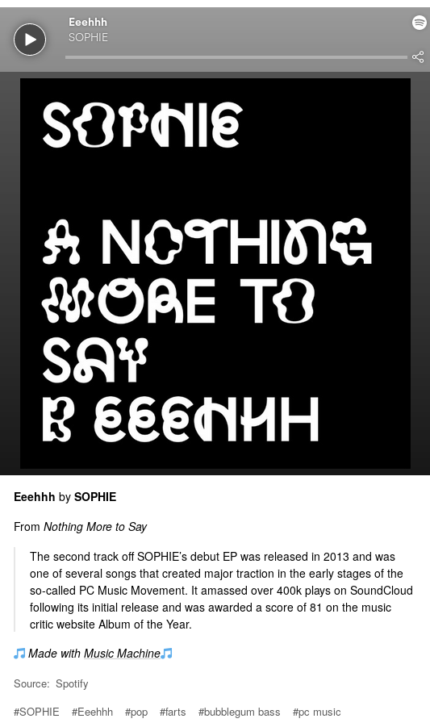

# Music Machine
A simple bot for sharing music on Tumblr. Uses APIs from IFTTT, Last FM and Genius to
automagically create Tumblr posts with descriptions and genre tags.

## Setup
You'll need an [IFTTT](https://ifttt.com) account, as well as your own API keys for Last FM and Genius.

1. Install [dependencies](#dependencies) using `npm install` after cloning and entering the repository
2. Add a Spotify -> [Webhooks](https://ifttt.com/maker_webhooks) recipe on IFTTT, with the following attributes:
    - IF Spotify: New track added to playlist (any playlist will do)
    - THEN Webhooks: Make web request
        - URL = (your web server address)
        - Method = `POST`
        - Content Type = `application/json`
        - Body = `{"TrackName": "{{TrackName}}", "TrackURL": "{{TrackURL}}", "ArtistName": "{{ArtistName}}", "AlbumName": "{{AlbumName}}"}`
3. Add a Webhooks -> Tumblr recipe on IFTTT, with the following attributes:
    - IF Webhooks: Event Name `post_song`
    - THEN Tumblr: Queue post
        - MP3 file URL: `{{Value1}}`
        - Caption: `{{Value2}}`
        - Tags: `{{Value3}}`
4. Put your (lastfm, ifttt, genius) keys in `keys.json`
5. Run `node machine.js`

Now when you add a song to your specified playlist, it will be looked up on Genius and Last FM.
The info from these sites will be used to create a nice little post on your blog!
(The post includes genre tags from Last FM and a song description from Genius)
NOTE: The server is configured to run on port 8000, change the port as you please.

## Example
Here is what your post will look like on the Tumblr dashboard:

The description is only added if one is found on the song's genius page.
The genre tags will be added only if the song is found on lastfm.

## Dependencies
- Express
- Request
